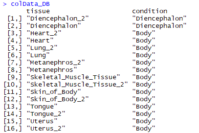
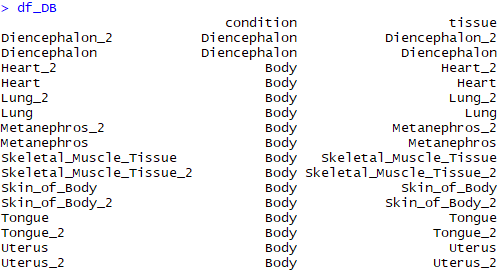

[TOC]

## DESeq2安装
source('http://bioconductor.org/biocLite.R')
biocLite('DESeq2')
library('DESeq2')
## 使用
 
###代码
```R
$ddsDESeq_DB<-DESeqDataSetFromMatrix(countData = Diencephalon_vs_Body,colData = colData_DB,design = ~condition) #构建dds矩阵，~在R里面用于构建公式对象，~左边为因变量，右边为自变量
$dds_DB <- DESeq(ddsDESeq) #标准化
$res_DB <- results(dds_DB) #差异分析结果
$head(res_DB)
$summary(res_DB) #看一下结果的概要信息
```
```R
$plotMA(dds_DB,ylim=c(-2,2)，main='DESeq2')
$dev.copy(png,'deseq2_MAplot.png')
$dev.off()
#使用lfcShrink对log2 fold change进行shrink，去除低拷贝基因的影响
$resLFC_DB <- lfcShrink(dds_DB,coef = 2)
$resLFC_DB
$plotMA(resLFC_DB,ylim = c(-2,2))
```
```R
#取padj小于0.05，表达倍数取以2为低的对数后大于1或者小于-1的差异表达结果
>table(res_DB$padj<0.05)
>res_DB <- res_DB[order(res_DB$padj),]
>diff_gene_deseq2 <- subset(res_DB,padj < 0.05 & (log2FoldChange > 1 | log2FoldChange < -1))
>resdata <- merge(as.data.frame(res_DB),as.data.frame(counts(dds_DB,normalize = TRUE)),by = "row.names",sort = FALSE)
>write.csv(resdata,file = "Diencephalon_vs_Body.csv",row.names = F)
```

**表达矩阵** 即countData，就是通过read count计算后并融合生成的矩阵，行为各个基因，列为各个样品，中间为计算reads或者fragment得到的整数。

**样品信息矩阵** 需要构建colData

示例：



**差异比较矩阵** 即design。

```R
$vsd_DB <- vst(dds_DB,)
$rld_DB <- rlog(dds_DB,blind=FALSE)
$select_DB<-order(rowMeans(counts(dds_DB,normalized=T)),decreasing = T)[1:50]
$df_DB<- as.data.frame(colData(dds_DB)[,c("condition","tissue")])
$pheatmap(assay(rld_DB)[select_DB,],cluster_rows = T,show_rownames = F,cluster_cols = F,annotation_col = df_DB,main = "Diencephalon_vs_Body_Heatmap")
```


###PCA分析
```R
#DESeq2
$plotPCA(vsd, intgroup=c("condition", "type"))
```

```R
#也可以使用ggplot2
> pcaData <- plotPCA(vsd, intgroup=c("condition", "tissue"), returnData=TRUE)
> percentVar <- round(100 * attr(pcaData, "percentVar"))
> ggplot(pcaData, aes(PC1, PC2, color=condition)) +
+     geom_point(size=3) +
+     xlab(paste0("PC1: ",percentVar[1],"% variance")) +
+     ylab(paste0("PC2: ",percentVar[2],"% variance")) + 
+     coord_fixed()
```

##其它
### Pre-filtering
```R
$keep <- rowSums(counts(dds_DB)) >= 10
$dds_DB <- dds_DB[keep,]
或
$dds_DB <- ddsHTSeq[rowSums(counts(ddsHTSeq)) > 1,] #将所有样本基因表达量之和小于0的基因过滤掉
```

###其它教程

[转录组入门7-用DESeq2进行差异表达分析](https://zhuanlan.zhihu.com/p/30350531)

[PANDA姐的转录组入门(7)：差异基因分析-2](https://mp.weixin.qq.com/s?__biz=MzIwNTEwMTUyOQ%3D%3D&idx=1&mid=2649694735&sn=5ad87d24643c08ab945288e086da4359)

[How to use DESeq2 to analyse RNAseq data](https://dwheelerau.com/2014/02/17/how-to-use-deseq2-to-analyse-rnaseq-data/)

[Analyzing RNA-seq data with DESeq2](https://bioconductor.org/packages/release/bioc/vignettes/DESeq2/inst/doc/DESeq2.html#pre-filtering
)

